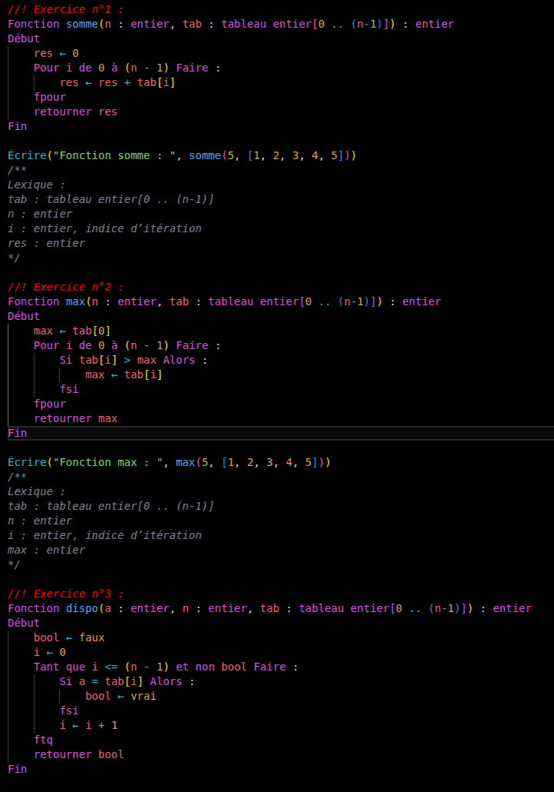
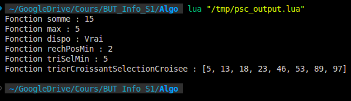

# Pseudo-Code Language Support

[](https://marketplace.visualstudio.com/items?itemName=LucasM54.PseudoCode-Interpreter)
[](https://marketplace.visualstudio.com/items?itemName=LucasM54.PseudoCode-Interpreter)



Cette extension transforme Visual Studio Code et VSCodium en un environnement de développement intégré (IDE) puissant et complet, spécialement conçu pour l'écriture et **l'exécution** de pseudo-code algorithmique en français. C'est l'outil idéal pour les étudiants, les enseignants et les développeurs qui souhaitent prototyper, apprendre, enseigner et **tester** leurs algorithmes avec une syntaxe claire et un outillage moderne.

[**Retrouvez l'extension sur la Marketplace Visual Studio Code !**](https://marketplace.visualstudio.com/items?itemName=LucasM54.PseudoCode-Interpreter)

---

## Fonctionnalités Principales

Cette extension n'est pas un simple colorateur syntaxique. C'est une suite d'outils complète pour écrire, valider et exécuter votre pseudo-code.

### 1. Exécution Instantanée du Code
**Donnez vie à vos algorithmes !** Plus besoin de traduire votre code à la main ou d'utiliser un autre outil.
-   **Bouton d'Exécution ▶️ :** Cliquez sur l'icône "Play" qui apparaît en haut à droite de vos fichiers `.psc` pour lancer votre code.
-   **Résultats en direct :** La sortie de votre programme (via la fonction `écrire()`) s'affiche directement dans le terminal intégré de VS Code.
-   **Aucune configuration requise :** L'extension s'occupe de tout en arrière-plan, en traduisant votre pseudo-code pour le rendre exécutable.



### 2. Coloration Syntaxique Avancée
Le code est coloré de manière logique pour une lisibilité maximale :
-   **Mots-clés de structure** (`Début`, `Fin`, `Algorithme`, `Fonction`, `Lexique`)
-   **Mots-clés de contrôle** (`Si`, `Alors`, `Sinon`, `fsi`, `Pour`, `Faire`, `fpour`, `Tant que`, `ftq`)
-   **Types de données** (`entier`, `réel`, `chaîne`, `booléen`, `tableau`)
-   **Variables, paramètres et appels de fonction**
-   **Chaînes de caractères, nombres et commentaires** (`//` et `/* */`)

### 3. Formatage de Code Automatique (Prettier-like)
**Raccourci : `Alt + Maj + F`**

Fini le code mal indenté ! Le formateur intelligent analyse votre fichier et applique automatiquement une indentation parfaite et cohérente.

**Avant :**
```psc
Fonction TestFormatage()
Début
Pour i de 1 à 10 Faire :
Si i mod 2 = 0 Alors :
écrire(i)
fsi
fpour
Fin
```

**Après `Alt + Maj + F` :**
```psc
Fonction TestFormatage()
Début
	Pour i de 1 à 10 Faire :
		Si i mod 2 = 0 Alors :
			écrire(i)
		fsi
	fpour
Fin
```

### 4. Analyse de Diagnostic en Temps Réel (Linting)
Ne perdez plus de temps à chercher des erreurs de frappe. L'analyseur intégré lit votre code en temps réel et souligne les erreurs de structure :
-   **Blocs non fermés** (un `Pour` sans son `fpour`).
-   **Blocs mal fermés** (un `Si` fermé par un `fpour`).
-   **Mots-clés de fermeture inattendus**.

### 5. Snippets de Code Intelligents
Accélérez votre écriture de code avec des extraits pré-configurés. Tapez simplement le préfixe et appuyez sur `Tab` :
-   `algorithme` → Crée un squelette d'algorithme principal.
-   `fonction` → Crée une structure de fonction complète.
-   `pour` → Insère une boucle `Pour`.
-   `si` / `sisinon` → Insère une condition `Si` ou `Si/Sinon`.
-   `tantque` → Insère une boucle `Tant que`.

### 6. Exploration de Symboles et Navigation
Naviguez facilement dans vos fichiers. La vue **"Outline" / "Plan"** de VS Code affiche une liste structurée de tous vos `Algorithmes` et `Fonctions`, vous permettant de sauter à une définition en un clic.

### 7. Fermeture Automatique des Blocs
Lorsque vous tapez une ligne qui ouvre un bloc (comme `Pour ... Faire :`) et que vous appuyez sur `Entrée`, l'extension insère automatiquement le mot-clé de fermeture correspondant (`fpour`).

---

## 📋 Prérequis (Pour l'exécution du code)

Pour utiliser la fonctionnalité **d'exécution instantanée du code** (bouton ▶️), l'interpréteur **Lua** doit être installé sur votre système :

### 🐧 Linux :
* **Ubuntu / Debian / Linux Mint :**
  ```bash
  sudo apt update && sudo apt install lua5.3
  # ou sudo apt install lua5.4
  ```
* **Arch Linux / Manjaro :**
  ```bash
  sudo pacman -S lua
  ```
* **Fedora / RHEL :**
  ```bash
  sudo dnf install lua
  ```

### 🍎 macOS :
```bash
brew install lua
```

### 🪟 Windows :
```powershell
# Via Winget
winget install Lua.Lua

# Ou via Chocolatey
choco install lua
```

> 💡 **Remarque :** Si vous utilisez l'extension uniquement pour l'écriture de pseudo-code, la coloration syntaxique, le linter et le formatage, l'installation de Lua n'est pas requise.

---

## 📦 Installation

### Option 1 : Visual Studio Code (Marketplace officiel)

1. Ouvrez **Visual Studio Code**.
2. Allez dans le panneau des **Extensions** (`Ctrl+Shift+X` / `Cmd+Shift+X`).
3. Recherchez **`PseudoCode-Interpreter`**.
4. Cliquez sur **Installer**.

👉 Vous pouvez également l'installer directement depuis la [Marketplace Visual Studio](https://marketplace.visualstudio.com/items?itemName=LucasM54.PseudoCode-Interpreter).

---

### Option 2 : VSCodium / Installation Manuelle (`.vsix`)

VSCodium n'utilisant pas par défaut la marketplace propriétaire de Microsoft, vous pouvez installer l'extension directement via son fichier `.vsix` :

#### Via l'interface graphique :
1. Téléchargez le fichier **`.vsix`** de la dernière version sur la page des [Releases GitHub](https://github.com/LucasM548/Pseudo-Code-Extension-VSC/releases).
2. Ouvrez **VSCodium** (ou VS Code).
3. Ouvrez le panneau des **Extensions** (`Ctrl+Shift+X`).
4. Cliquez sur le menu avec les trois petits points **`···`** (en haut à droite du panneau Extensions).
5. Choisissez **"Installer depuis un VSIX..."** (*"Install from VSIX..."*).
6. Sélectionnez le fichier `.vsix` que vous venez de télécharger.

#### Via le terminal (Ligne de commande) :
```bash
# Pour VSCodium
codium --install-extension pseudocode-interpreter-0.3.0.vsix

# Pour VS Code
code --install-extension pseudocode-interpreter-0.3.0.vsix
```

---

## 🛠️ Guide de Développement & Tests

Ce guide s'adresse aux contributeurs et développeurs souhaitant modifier, tester ou faire évoluer l'extension.

### 1. Architecture & Sources Uniques de Vérité

Le projet est articulé autour de **sources uniques de vérité** pour garantir la cohérence absolue de tous les composants :
- **[`src/definitions.ts`](src/definitions.ts)** : Registre central de tous les mots-clés, types et fonctions intégrées (arités, descriptions, signatures, snippets, catégories, équivalents et helpers Lua).
- **[`src/blocks.ts`](src/blocks.ts)** : Définition déclarative de tous les blocs et structures de contrôle (`Si`, `Pour`, `Tant que`, `Début`...). Il alimente automatiquement le linter (*search-and-recover*), l'indentation automatique (`onEnterRules`), le formateur et les snippets de fermeture.
- **[`syntaxes/psc.tmLanguage.json`](syntaxes/psc.tmLanguage.json)** : **Ne jamais modifier ce fichier à la main.** Il est généré automatiquement par `scripts/generate-grammar.ts` à partir de `definitions.ts` et `blocks.ts`.

### 2. Commandes Utiles

```bash
# Installer les dépendances
npm install

# Compiler le projet (déclenche automatiquement generate-grammar)
npm run compile

# Mode surveillance (recompilation continue à chaque sauvegarde)
npm run watch

# Régénérer manuellement la grammaire TextMate
npm run generate-grammar

# Packager l'extension en fichier .vsix
npm run package
```

### 3. Tester l'Extension dans VS Code / VSCodium (Extension Host)

1. Ouvrez le projet dans VS Code ou VSCodium.
2. Appuyez sur **`F5`** (ou menu *Exécuter et déboguer* > *Lancer l'extension*).
3. Une nouvelle fenêtre VS Code s'ouvre avec l'extension active.
4. Ouvrez n'importe quel fichier `.psc` pour tester en direct :
   - La coloration syntaxique
   - L'autocomplétion contextuelle et l'aide aux paramètres
   - Le linter et les diagnostics d'erreurs en temps réel
   - Le formatage automatique (`Alt + Maj + F`)
   - L'exécution du code (Bouton ▶️ en haut à droite)

### 4. Tester le Fichier de Démonstration (`examples/MEGA_DEMO_COMPLEXE.psc`)

Le dépôt contient un fichier de démonstration et de benchmark exhaustif : [`examples/MEGA_DEMO_COMPLEXE.psc`](examples/MEGA_DEMO_COMPLEXE.psc). Il couvre l'ensemble des fonctionnalités du langage :
- Algorithme principal et fonctions avec paramètres `InOut`
- Structures de contrôle imbriquées (`Si / Sinon si / Sinon`, `Pour`, `Tant que`)
- Types composites / structures personnalisées (`Point`, `Personne`...)
- Tous les types de données abstraits (Listes, Listes Symétriques, Piles, Files, Tables)
- Manipulation de chaînes de caractères et opérations de fichiers

#### Option A : Test d'Exécution en Ligne de Commande (CLI)
Vous pouvez transpiler et exécuter la méga-démo directement via le terminal sans lancer de fenêtre VS Code :

```bash
# 1. Compiler l'extension
npm run compile

# 2. Transpiler le pseudo-code en Lua
node -e "
const { transpileToLua } = require('./out/executor');
const fs = require('fs');
const code = fs.readFileSync('examples/MEGA_DEMO_COMPLEXE.psc', 'utf-8');
const lua = transpileToLua(code);
fs.writeFileSync('out_demo.lua', lua);
console.log('✓ Transpilation réussie (' + lua.length + ' caractères générés)');
"

# 3. Exécuter avec Lua
lua out_demo.lua
# ou sous Linux/macOS selon votre version : lua5.4 out_demo.lua
```

#### Option B : Test Graphique dans l'Hôte d'Extension
1. Lancez l'hôte avec **`F5`**.
2. Ouvrez le fichier `examples/MEGA_DEMO_COMPLEXE.psc`.
3. Cliquez sur le bouton ▶️ en haut à droite (ou tapez `Ctrl+Alt+R`) : le terminal affiche l'ensemble des résultats d'exécution.

---

## Contributions

Les contributions, les rapports de bugs et les suggestions de fonctionnalités sont les bienvenus ! N'hésitez pas à ouvrir une "Issue" ou une "Pull Request" sur le dépôt GitHub du projet.

---

## 🤖 Développement & Intelligence Artificielle

Ce projet est développé en adoptant une approche de **pair-programming avec l'intelligence artificielle** (*vibe coding*). Les outils d'IA sont activement utilisés pour accélérer le prototypage, explorer de nouvelles fonctionnalités et assister la conception technique ou la documentation.
